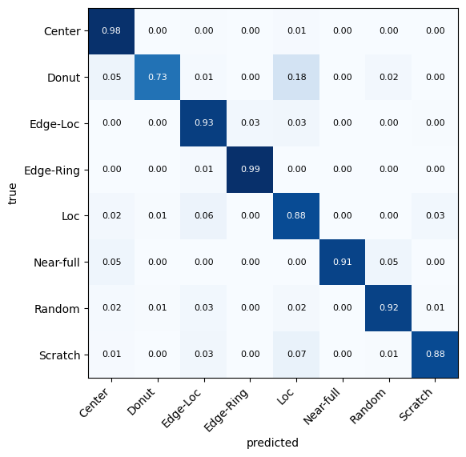
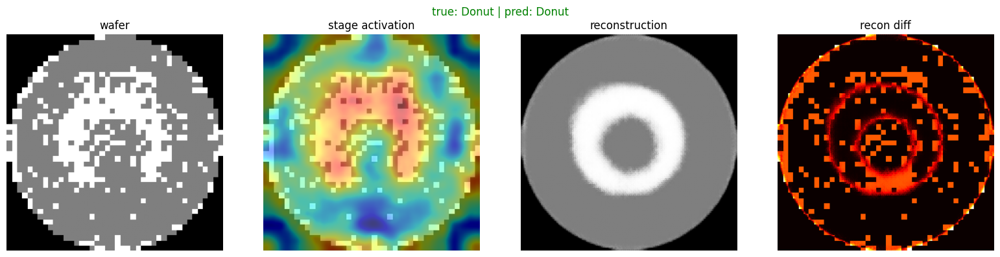
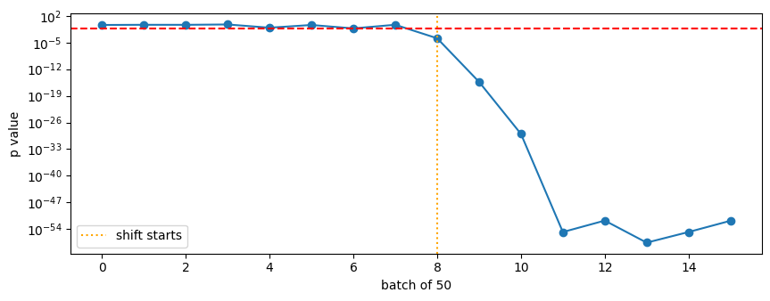

# wafer-defect-swin

[](https://github.com/arihaaant/wafer-defect-swin/actions/workflows/ci.yml)

Defect pattern classification on the WM-811K wafer map dataset using a Swin-Tiny backbone, plus a couple of explanation maps and a simple drift monitor on the prediction stream.

WM-811K has 811k wafer maps, but only 25,519 of them have one of the 8 defect labels (Center, Donut, Edge-Loc, Edge-Ring, Loc, Near-full, Random, Scratch). That's what this trains on, with a 70/15/15 stratified split. The classes are very imbalanced: Edge-Ring has ~9.7k samples and Near-full has 149.

## setup

- Swin-Tiny (timm, ImageNet weights) with a small classification head
- a conv decoder that reconstructs the wafer from the pooled features, trained jointly (focal + 0.3 * L1)
- focal loss (gamma=2) and mixup (alpha=0.2)
- 20 epochs, best epoch picked on val macro F1, test set evaluated once

## results

All runs on one A100, about 8 minutes each. The full run with every output is in [`notebooks/wafer_defect_swin_training.ipynb`](notebooks/wafer_defect_swin_training.ipynb).

I started with three imbalance fixes stacked together (a balanced sampler, inverse-frequency class weights in the loss, and focal loss) and ablated them:

| run | balanced sampler | class weights | mixup | val macro F1 | test macro F1 | test acc |
|---|---|---|---|---|---|---|
| no rebalancing | | | yes | **0.926** | **0.917** | **0.946** |
| sampler only | yes | | yes | 0.913 | 0.908 | 0.936 |
| class weights only | | yes | yes | 0.792 | 0.794 | 0.830 |
| sampler + weights, no mixup | yes | yes | | 0.775 | 0.773 | 0.801 |
| sampler + weights | yes | yes | yes | 0.749 | 0.753 | 0.787 |

Stacking the sampler and the class weights corrects the imbalance twice. The sampler already shows every class equally often, and the weights then make each Near-full error count about 65x more than an Edge-Ring error. The model responds by over-predicting rare classes: in the stacked run Scratch has 0.97 recall but 0.40 precision, and Random and Donut look the same. The class weights are what hurt most. Focal loss on its own was enough here.

Per class on the test set for the best run (no rebalancing):

| class | precision | recall |
|---|---|---|
| Center | 0.965 | 0.980 |
| Donut | 0.910 | 0.735 |
| Edge-Loc | 0.917 | 0.931 |
| Edge-Ring | 0.986 | 0.986 |
| Loc | 0.885 | 0.881 |
| Near-full | 1.000 | 0.909 |
| Random | 0.930 | 0.915 |
| Scratch | 0.883 | 0.883 |



Donut is the weak spot: 18% of Donut wafers get called Loc. Near-full has only 22 test samples, so its numbers are noisy.

### explanation maps



The decoder ends up reconstructing a clean prototype of the class (a perfect ring for Donut) rather than the actual wafer, so the diff map mostly highlights scattered defective dies that don't belong to the pattern. The stage activation map is just the mean activation of each Swin stage, not attention rollout.

### drift monitor

The monitor runs a chi-square test on the predicted class mix over a rolling window of 200 wafers against the mix predicted on the training set. For the test I streamed 400 normal wafers followed by 400 where Edge-Loc and Scratch make up 80% (a simulated process shift), in batches of 50.



No false alarms on the normal part, and it flagged the shift on the first batch after it started (at that point the window is only 25% shifted data).

## running it

Colab: open the notebook, add `KAGGLE_USERNAME` / `KAGGLE_KEY` as Colab secrets, pick an A100 and run all. It pulls the data with kagglehub and saves everything to Drive.

Locally:

```bash
pip install -e ".[dev]"
python -m waferdefect.train --data LSWMD.pkl --out runs/best --no-balanced-sampler --no-class-weights
pytest
```

Each run writes config.json, history.json, metrics.json and best.pt. The package defaults are the original stacked setup, so the flags above are needed for the best config.

## notes

- Mixup was only ablated with both rebalancing methods on (0.773 without it vs 0.753 with it), so I can't say whether it helps in the best config.
- The drift monitor only looks at the predicted class mix. It won't catch a shift that makes predictions wrong without changing the mix.
- One seed per config. The gaps between the top two runs (0.917 vs 0.908) are small enough that a few seeds would be needed to call it.
